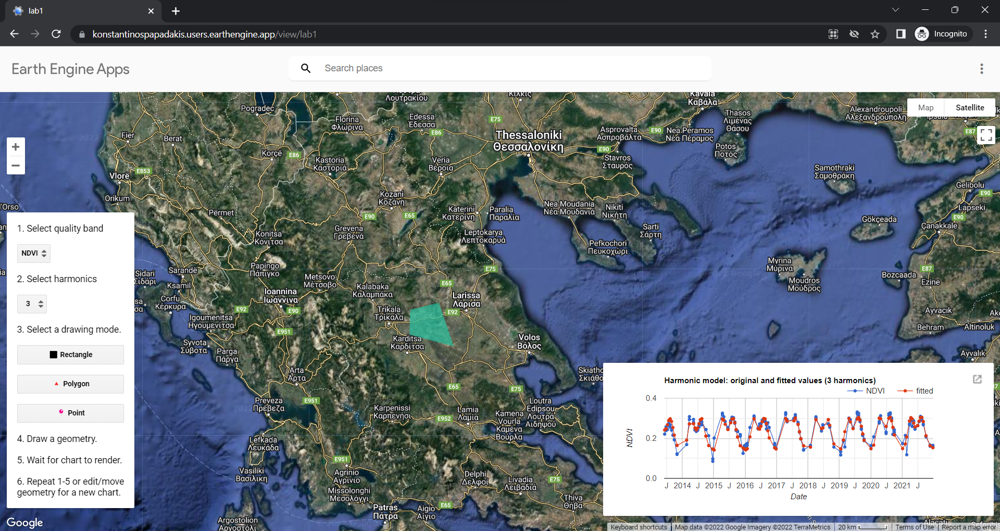

# Analysis on multispectral satellite images with Google Earth Engine

[Results](presentation.pdf)

[Custom App](https://konstantinospapadakis.users.earthengine.app/view/lab1)

[Project's Repository on Google Earth Engine](https://code.earthengine.google.com/?accept_repo=users/KonstantinosPapadakis/GeospatialLabs)
