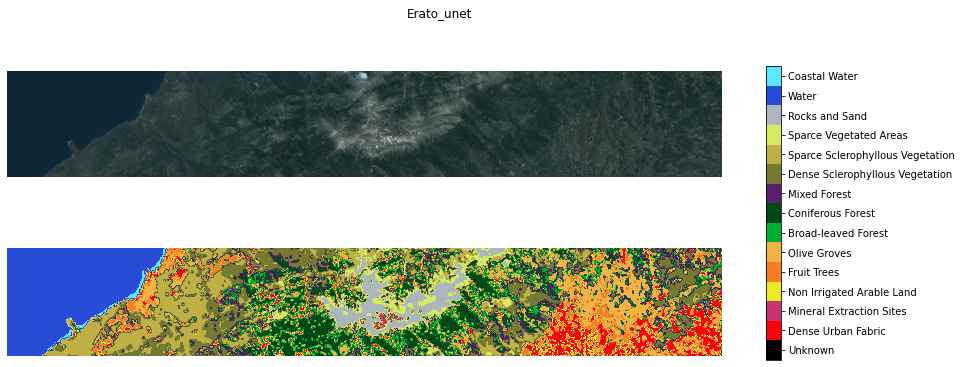

# Image Segmentation on multispectral satellite images with pixel-wise and patch-wise approaches

Training and inference are performed in [main.py](main.py) which utilizes the modules in [lab3](lab3/) where the core classes and functions are implemented.

A presentation of the results can be found in [Geospatial Lab 3.pdf](<Geospatial Lab 3.pdf>).
